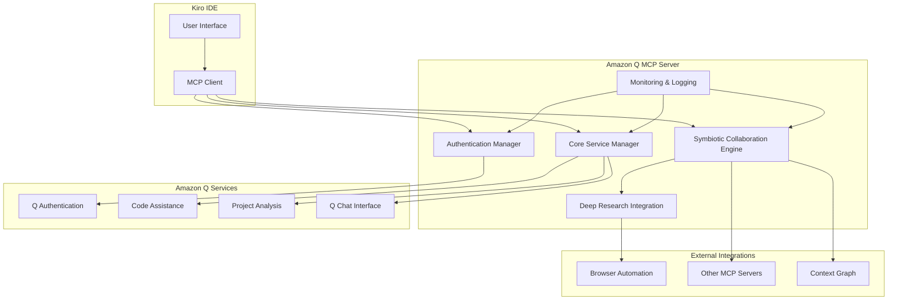

# Design Document

## Overview

The Amazon Q Integration feature creates a comprehensive symbiotic AI collaboration system that leverages Amazon Q Developer's capabilities within the Kiro IDE ecosystem. This design builds upon the existing amazon-q-symbiotic-mcp.py server to provide unlimited AI-powered development support with autonomous capabilities, deep research integration, and seamless collaboration with other MCP servers.

## Architecture

### High-Level Architecture



### Component Architecture

The system consists of five main components:

1. **Authentication Manager**: Handles Amazon Q authentication and session management
2. **Core Service Manager**: Provides direct access to Amazon Q capabilities
3. **Symbiotic Collaboration Engine**: Enables autonomous and proactive AI assistance
4. **Deep Research Integration**: Enhances responses with comprehensive research
5. **Monitoring & Logging**: Tracks activities and performance metrics

## Components and Interfaces

### Authentication Manager

**Purpose**: Manages Amazon Q authentication, session persistence, and connection health.

**Key Methods**:
- `authenticate()`: Performs SSO authentication with Amazon Q
- `refresh_session()`: Refreshes authentication tokens
- `check_connection()`: Monitors connection health
- `handle_auth_errors()`: Manages authentication failures

**Configuration**:
- AWS Profile: amazon-q-developer
- AWS Region: us-east-1
- Account ID: 288045296426

### Core Service Manager

**Purpose**: Provides direct interface to Amazon Q's core capabilities.

**Key Methods**:
- `get_code_assistance()`: Requests code completion, explanation, or optimization
- `analyze_project()`: Performs architecture, security, performance, or quality analysis
- `chat_with_q()`: Enables conversational interaction with Amazon Q
- `process_request()`: Routes and processes various request types

**Request Types**:
- Code completion
- Code explanation
- Code optimization
- Debugging assistance
- Project analysis (architecture, security, performance, quality)

### Symbiotic Collaboration Engine

**Purpose**: Enables autonomous operation and intelligent collaboration with other systems.

**Key Features**:
- **Autonomous Mode**: Proactive suggestions and self-directed improvements
- **Collaboration Levels**: Adjustable interaction styles (1-10 scale)
- **Context Awareness**: Adapts behavior based on current development context
- **Multi-Agent Coordination**: Collaborates with other MCP servers

**Collaboration Modes**:
- Research: Focus on information gathering and analysis
- Development: Emphasis on code assistance and optimization
- Optimization: System-wide performance and quality improvements
- Learning: Adaptive behavior based on user patterns

### Deep Research Integration

**Purpose**: Enhances Amazon Q responses with comprehensive external research.

**Integration Points**:
- Browser automation for web research
- Documentation analysis and synthesis
- Best practices research
- Technology comparison and evaluation

**Research Capabilities**:
- Depth levels (1-10): Adjustable research scope
- Source diversity: Multiple information sources
- Real-time updates: Current information integration
- Context relevance: Research tailored to specific needs

### Monitoring & Logging

**Purpose**: Provides comprehensive activity tracking and performance monitoring.

**Logging Features**:
- Activity logs with timestamps
- Error tracking and analysis
- Performance metrics (response times, success rates)
- Audit trails for compliance
- Alert mechanisms for critical events

## Data Models

### Authentication State

```typescript
interface AuthState {
  isAuthenticated: boolean;
  sessionToken: string;
  expiresAt: Date;
  accountId: string;
  region: string;
  lastRefresh: Date;
}
```

### Request Context

```typescript
interface RequestContext {
  requestId: string;
  userId: string;
  projectPath: string;
  currentFile: string;
  codeContext: string;
  requestType: string;
  timestamp: Date;
  metadata: Record<string, any>;
}
```

### Collaboration Settings

```typescript
interface CollaborationSettings {
  autonomousMode: boolean;
  autonomyLevel: number; // 1-10
  collaborationMode: 'research' | 'development' | 'optimization' | 'learning';
  researchDepth: number; // 1-10
  enableBrowserIntegration: boolean;
  contextSharingEnabled: boolean;
}
```

### Activity Log

```typescript
interface ActivityLog {
  logId: string;
  timestamp: Date;
  action: string;
  requestContext: RequestContext;
  response: any;
  duration: number;
  success: boolean;
  errorDetails?: string;
}
```

## Error Handling

### Authentication Errors
- **Token Expiration**: Automatic refresh with fallback to re-authentication
- **Invalid Credentials**: Clear error messages with setup guidance
- **Network Issues**: Retry mechanisms with exponential backoff
- **Service Unavailable**: Graceful degradation with local fallbacks

### Service Errors
- **API Rate Limits**: Intelligent request queuing and throttling
- **Request Timeouts**: Configurable timeout handling with retries
- **Invalid Responses**: Response validation and error recovery
- **Service Degradation**: Automatic fallback to alternative approaches

### Integration Errors
- **MCP Communication**: Connection monitoring and automatic reconnection
- **Browser Automation**: Fallback to alternative research methods
- **Context Graph**: Local caching with eventual consistency
- **File System**: Permission handling and safe operation modes

## Testing Strategy

### Unit Testing
- Authentication flow testing with mocked AWS services
- Core service method testing with Amazon Q API mocks
- Collaboration engine logic testing with simulated scenarios
- Error handling testing with various failure conditions

### Integration Testing
- End-to-end authentication with real Amazon Q services
- MCP protocol compliance testing
- Cross-server communication testing
- Browser automation integration testing

### Performance Testing
- Response time benchmarking under various loads
- Memory usage monitoring during extended sessions
- Concurrent request handling validation
- Resource cleanup verification

### Security Testing
- Credential handling and storage security
- API key protection and rotation
- Network communication encryption
- Access control and privilege validation

## Security Considerations

### Credential Management
- Secure storage of authentication tokens
- Automatic token rotation and refresh
- Encrypted communication channels
- Audit logging of authentication events

### Access Control
- Principle of least privilege implementation
- Role-based access control for different features
- User consent for autonomous actions
- Configurable permission levels

### Data Protection
- Code context encryption in transit and at rest
- PII detection and protection mechanisms
- Secure logging with sensitive data masking
- Compliance with data protection regulations

## Performance Optimization

### Caching Strategy
- Response caching for frequently requested information
- Context caching to reduce redundant API calls
- Intelligent cache invalidation based on code changes
- Distributed caching for multi-user scenarios

### Request Optimization
- Request batching for improved efficiency
- Parallel processing for independent operations
- Smart request prioritization based on user context
- Adaptive timeout management

### Resource Management
- Connection pooling for Amazon Q services
- Memory management for large codebases
- Background processing for non-critical operations
- Graceful resource cleanup and garbage collection

## Deployment and Configuration

### Environment Setup
- AWS credentials configuration
- Amazon Q service region selection
- MCP server registration and startup
- Integration with existing Kiro infrastructure

### Configuration Management
- Environment-specific settings
- User preference management
- Feature flag controls
- Runtime configuration updates

### Monitoring and Maintenance
- Health check endpoints
- Performance metric collection
- Automated error reporting
- Update and patch management