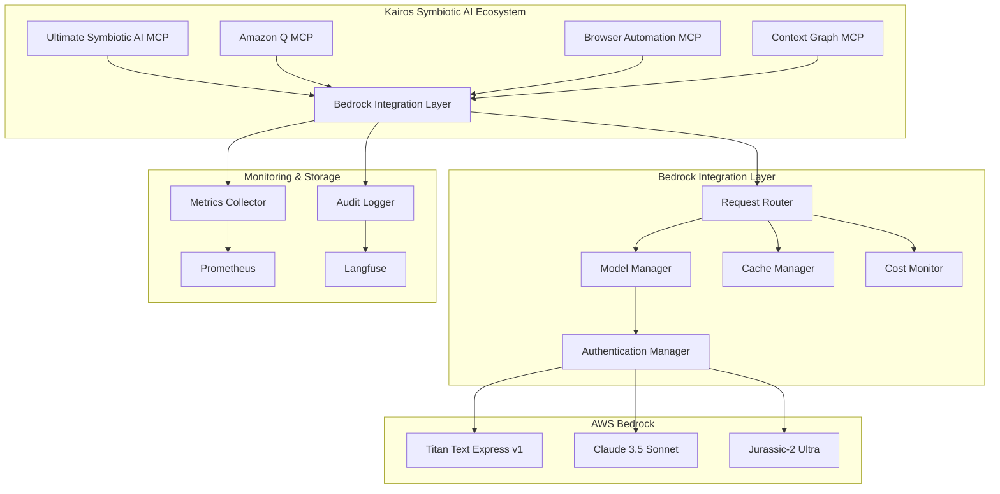
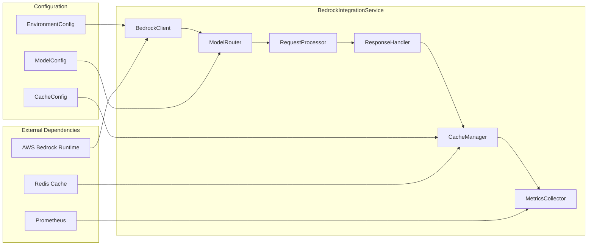
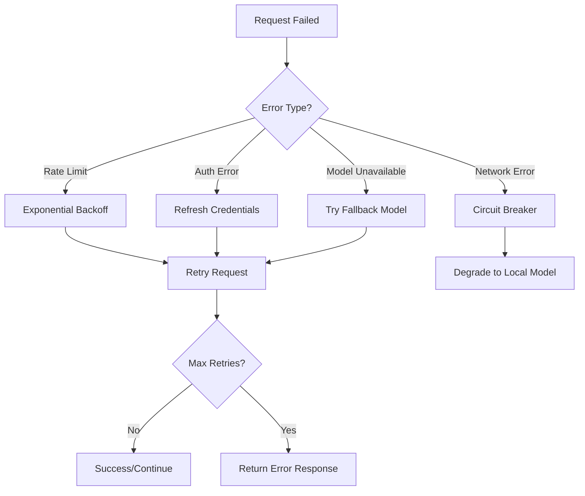

# AWS Bedrock Real Integration - Design Document

## Overview

The AWS Bedrock Real Integration design provides a comprehensive architecture for integrating multiple foundation models (Amazon Titan, Anthropic Claude, AI21 Jurassic) into the Kairos Symbiotic AI ecosystem. This design emphasizes performance, reliability, cost optimization, and seamless integration with existing MCP servers.

## Architecture

### High-Level Architecture



### Component Architecture



## Components and Interfaces

### 1. BedrockIntegrationService

**Primary Interface:**
```python
class BedrockIntegrationService:
    async def generate_text(
        self, 
        prompt: str, 
        model_preference: Optional[str] = None,
        max_tokens: int = 4096,
        temperature: float = 0.7,
        context: Optional[Dict] = None
    ) -> BedrockResponse
    
    async def batch_generate(
        self, 
        requests: List[BedrockRequest]
    ) -> List[BedrockResponse]
    
    async def get_available_models(self) -> List[ModelInfo]
    
    async def health_check(self) -> HealthStatus
```

**Key Responsibilities:**
- Manage AWS Bedrock client connections
- Route requests to appropriate models
- Handle authentication and credential management
- Implement caching and performance optimization
- Collect metrics and audit logs

### 2. ModelRouter

**Interface:**
```python
class ModelRouter:
    def select_model(
        self, 
        request: BedrockRequest, 
        available_models: List[str]
    ) -> str
    
    def get_fallback_models(self, primary_model: str) -> List[str]
    
    def update_model_performance(
        self, 
        model: str, 
        metrics: PerformanceMetrics
    ) -> None
```

**Routing Logic:**
- **Code-related queries** → Claude 3.5 Sonnet (best for programming)
- **General text generation** → Amazon Titan (cost-effective)
- **Complex reasoning** → Jurassic-2 Ultra (advanced reasoning)
- **Fallback chain** → Titan → Claude → Jurassic

### 3. CacheManager

**Interface:**
```python
class CacheManager:
    async def get_cached_response(
        self, 
        cache_key: str
    ) -> Optional[BedrockResponse]
    
    async def cache_response(
        self, 
        cache_key: str, 
        response: BedrockResponse,
        ttl: int = 300
    ) -> None
    
    def generate_cache_key(self, request: BedrockRequest) -> str
```

**Caching Strategy:**
- **Cache Key:** Hash of (prompt + model + parameters)
- **TTL:** 5 minutes for standard queries, 1 hour for static content
- **Storage:** Redis for distributed caching
- **Invalidation:** LRU with size limits

### 4. AuthenticationManager

**Interface:**
```python
class AuthenticationManager:
    async def get_bedrock_client(self) -> BedrockRuntimeClient
    
    async def refresh_credentials(self) -> None
    
    def validate_credentials(self) -> bool
    
    async def handle_auth_error(self, error: Exception) -> None
```

**Authentication Flow:**
1. Load credentials from environment variables
2. Create AWS session with IAM role or access keys
3. Initialize Bedrock runtime client
4. Implement credential rotation handling
5. Provide fallback authentication methods

## Data Models

### BedrockRequest
```python
@dataclass
class BedrockRequest:
    prompt: str
    model_preference: Optional[str] = None
    max_tokens: int = 4096
    temperature: float = 0.7
    top_p: float = 0.9
    top_k: int = 250
    stop_sequences: List[str] = field(default_factory=list)
    context: Optional[Dict] = None
    request_id: str = field(default_factory=lambda: str(uuid.uuid4()))
    timestamp: datetime = field(default_factory=datetime.now)
```

### BedrockResponse
```python
@dataclass
class BedrockResponse:
    text: str
    model_used: str
    tokens_used: int
    response_time: float
    cost_estimate: float
    request_id: str
    timestamp: datetime
    cached: bool = False
    metadata: Optional[Dict] = None
```

### ModelInfo
```python
@dataclass
class ModelInfo:
    model_id: str
    name: str
    provider: str
    max_tokens: int
    cost_per_token: float
    available: bool
    performance_score: float
    last_updated: datetime
```

## Error Handling

### Error Categories and Responses

```python
class BedrockErrorHandler:
    def handle_error(self, error: Exception) -> BedrockResponse:
        if isinstance(error, ThrottlingException):
            return self._handle_rate_limit(error)
        elif isinstance(error, ValidationException):
            return self._handle_validation_error(error)
        elif isinstance(error, ModelNotAvailableException):
            return self._handle_model_unavailable(error)
        elif isinstance(error, AuthenticationException):
            return self._handle_auth_error(error)
        else:
            return self._handle_generic_error(error)
```

### Retry Strategy



## Testing Strategy

### Unit Testing
- **BedrockIntegrationService**: Mock AWS Bedrock client, test all methods
- **ModelRouter**: Test routing logic with various input scenarios
- **CacheManager**: Test cache hit/miss scenarios, TTL expiration
- **AuthenticationManager**: Test credential validation and refresh

### Integration Testing
- **AWS Bedrock Connection**: Test with real AWS credentials in staging
- **Model Inference**: Test each supported model with sample prompts
- **Error Scenarios**: Test rate limiting, model unavailability, auth failures
- **Performance**: Load testing with concurrent requests

### End-to-End Testing
- **MCP Integration**: Test calls from all MCP servers
- **Failover Scenarios**: Test model fallback chains
- **Cost Monitoring**: Verify cost tracking accuracy
- **Monitoring Integration**: Test Prometheus metrics and Langfuse traces

## Performance Optimization

### Request Batching
```python
class BatchProcessor:
    async def process_batch(
        self, 
        requests: List[BedrockRequest]
    ) -> List[BedrockResponse]:
        # Group requests by model
        model_groups = self._group_by_model(requests)
        
        # Process each group concurrently
        tasks = [
            self._process_model_group(model, group_requests)
            for model, group_requests in model_groups.items()
        ]
        
        return await asyncio.gather(*tasks)
```

### Connection Pooling
- **Pool Size**: 10 concurrent connections per model
- **Connection Reuse**: Keep connections alive for 5 minutes
- **Load Balancing**: Round-robin across available connections

### Caching Strategy
- **L1 Cache**: In-memory LRU cache (100 MB limit)
- **L2 Cache**: Redis distributed cache (1 GB limit)
- **Cache Warming**: Pre-populate common queries
- **Smart Invalidation**: Invalidate based on content similarity

## Security Implementation

### Credential Management
```python
class SecureCredentialManager:
    def __init__(self):
        self.kms_client = boto3.client('kms')
        self.secrets_manager = boto3.client('secretsmanager')
    
    async def get_encrypted_credentials(self) -> Dict[str, str]:
        # Retrieve from AWS Secrets Manager
        secret = await self.secrets_manager.get_secret_value(
            SecretId='kairos/bedrock/credentials'
        )
        return json.loads(secret['SecretString'])
    
    def encrypt_sensitive_data(self, data: str) -> str:
        # Use AWS KMS for encryption
        response = self.kms_client.encrypt(
            KeyId='alias/kairos-bedrock-key',
            Plaintext=data
        )
        return base64.b64encode(response['CiphertextBlob']).decode()
```

### Data Protection
- **Encryption in Transit**: TLS 1.3 for all AWS communications
- **Encryption at Rest**: AES-256 for cached responses
- **Data Sanitization**: Remove PII from logs and metrics
- **Access Control**: IAM roles with least-privilege principles

## Monitoring and Observability

### Metrics Collection
```python
class MetricsCollector:
    def __init__(self):
        self.prometheus_client = PrometheusClient()
        self.langfuse_client = LangfuseClient()
    
    def record_request_metrics(self, request: BedrockRequest, response: BedrockResponse):
        # Prometheus metrics
        self.prometheus_client.increment_counter(
            'bedrock_requests_total',
            labels={'model': response.model_used, 'status': 'success'}
        )
        
        self.prometheus_client.record_histogram(
            'bedrock_response_time_seconds',
            response.response_time,
            labels={'model': response.model_used}
        )
        
        # Langfuse tracing
        self.langfuse_client.trace(
            name='bedrock_inference',
            input=request.prompt,
            output=response.text,
            metadata={
                'model': response.model_used,
                'tokens': response.tokens_used,
                'cost': response.cost_estimate
            }
        )
```

### Key Metrics
- **Request Rate**: Requests per second by model
- **Response Time**: P50, P95, P99 latencies
- **Error Rate**: Errors per minute by type
- **Token Usage**: Tokens consumed per model
- **Cost Tracking**: Daily/weekly spend by model
- **Cache Hit Rate**: Cache effectiveness metrics

## Deployment Configuration

### Environment Variables
```bash
# AWS Configuration
AWS_BEDROCK_REGION=us-east-1
AWS_BEDROCK_ACCESS_KEY_ID=your-access-key
AWS_BEDROCK_SECRET_ACCESS_KEY=your-secret-key

# Model Configuration
BEDROCK_DEFAULT_MODEL=amazon.titan-text-express-v1
BEDROCK_FALLBACK_MODELS=anthropic.claude-3-5-sonnet,ai21.j2-ultra

# Performance Configuration
BEDROCK_MAX_CONCURRENT_REQUESTS=10
BEDROCK_REQUEST_TIMEOUT=30
BEDROCK_CACHE_TTL=300

# Cost Management
BEDROCK_DAILY_COST_LIMIT=100.00
BEDROCK_COST_ALERT_THRESHOLD=80.00

# Monitoring
BEDROCK_METRICS_ENABLED=true
BEDROCK_LANGFUSE_ENABLED=true
```

### Docker Configuration
```dockerfile
FROM python:3.11-slim

WORKDIR /app

COPY requirements.txt .
RUN pip install -r requirements.txt

COPY . .

ENV PYTHONPATH=/app
ENV AWS_DEFAULT_REGION=us-east-1

EXPOSE 8000

CMD ["python", "-m", "bedrock_integration.main"]
```

This comprehensive design provides a robust, scalable, and secure foundation for AWS Bedrock integration within the Kairos Symbiotic AI ecosystem.