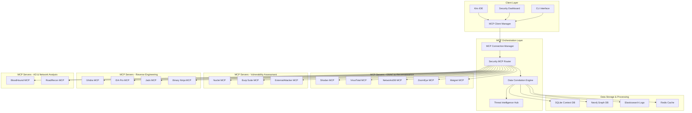
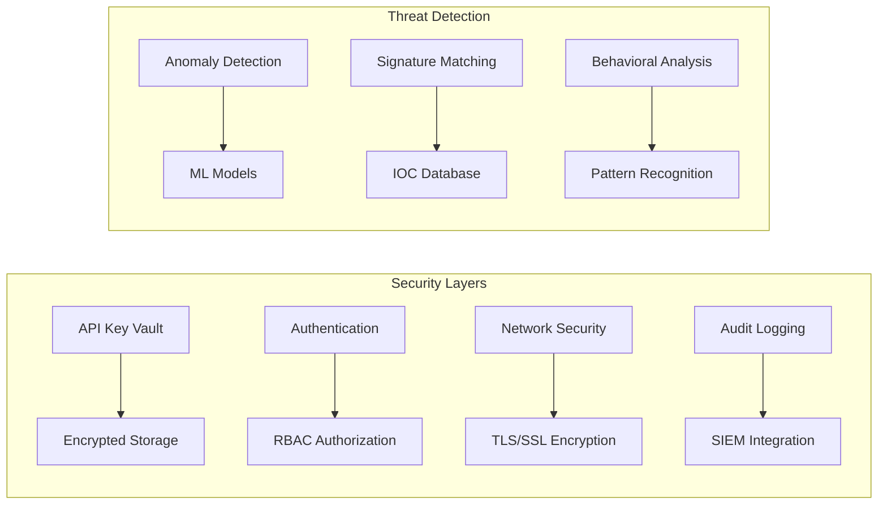

# Design Document

## Overview

The Cyber Security MCP Ecosystem is a comprehensive security automation platform that integrates multiple Model Context Protocol (MCP) servers to provide unified threat intelligence, vulnerability assessment, and security monitoring capabilities. The system leverages AI-powered automation to correlate data from various security tools and provide actionable insights for security professionals.

## Architecture

### High-Level Architecture



### Security Architecture



## Components and Interfaces

### 1. MCP Connection Manager

**Purpose:** Manages connections to all cyber security MCP servers with health monitoring and automatic reconnection.

**Key Features:**
- Connection pooling and load balancing
- Exponential backoff retry mechanism
- Health check monitoring every 30 seconds
- Graceful degradation when servers are unavailable

**Interface:**
```python
class MCPConnectionManager:
    def connect_server(self, server_config: MCPServerConfig) -> bool
    def disconnect_server(self, server_id: str) -> bool
    def get_server_status(self, server_id: str) -> ServerStatus
    def list_available_tools(self, server_id: str) -> List[Tool]
    def execute_tool(self, server_id: str, tool_name: str, params: dict) -> ToolResult
```

### 2. Security MCP Router

**Purpose:** Routes security-related requests to appropriate MCP servers based on tool capabilities and current load.

**Key Features:**
- Intelligent routing based on tool capabilities
- Load balancing across multiple servers
- Request queuing and rate limiting
- Tool discovery and capability mapping

**Interface:**
```python
class SecurityMCPRouter:
    def route_osint_request(self, target: str, tools: List[str]) -> List[OSINTResult]
    def route_vulnerability_scan(self, target: str, scan_type: str) -> VulnScanResult
    def route_reverse_engineering(self, binary_path: str, tool: str) -> REResult
    def route_ad_analysis(self, bloodhound_data: str) -> ADAnalysisResult
```

### 3. Data Correlation Engine

**Purpose:** Correlates and normalizes data from multiple security tools to provide unified threat intelligence.

**Key Features:**
- Multi-source data normalization
- Confidence scoring and prioritization
- Duplicate detection and merging
- Temporal correlation analysis

**Interface:**
```python
class DataCorrelationEngine:
    def correlate_osint_data(self, results: List[OSINTResult]) -> CorrelatedThreatIntel
    def merge_vulnerability_findings(self, scans: List[VulnScanResult]) -> MergedVulnReport
    def calculate_confidence_score(self, finding: SecurityFinding) -> float
    def detect_attack_patterns(self, events: List[SecurityEvent]) -> List[AttackPattern]
```

### 4. Threat Intelligence Hub

**Purpose:** Centralized hub for threat intelligence aggregation, enrichment, and distribution.

**Key Features:**
- IOC (Indicators of Compromise) management
- Threat feed integration
- Attribution and campaign tracking
- Automated threat hunting queries

**Interface:**
```python
class ThreatIntelligenceHub:
    def enrich_ioc(self, ioc: str, ioc_type: str) -> EnrichedIOC
    def query_threat_feeds(self, query: ThreatQuery) -> List[ThreatIntel]
    def track_campaign(self, campaign_id: str) -> CampaignInfo
    def generate_hunting_queries(self, threat_type: str) -> List[HuntingQuery]
```

## Data Models

### Core Security Entities

```python
@dataclass
class SecurityTarget:
    id: str
    type: TargetType  # DOMAIN, IP, URL, HASH, etc.
    value: str
    metadata: Dict[str, Any]
    discovered_at: datetime
    last_scanned: datetime

@dataclass
class SecurityFinding:
    id: str
    target_id: str
    finding_type: FindingType  # VULNERABILITY, THREAT, ANOMALY
    severity: SeverityLevel
    confidence_score: float
    source_tool: str
    raw_data: Dict[str, Any]
    normalized_data: Dict[str, Any]
    created_at: datetime

@dataclass
class ThreatIntelligence:
    id: str
    ioc_value: str
    ioc_type: IOCType
    threat_type: str
    malware_family: Optional[str]
    attribution: Optional[str]
    confidence: float
    sources: List[str]
    first_seen: datetime
    last_seen: datetime
```

### MCP Server Configuration

```python
@dataclass
class MCPServerConfig:
    id: str
    name: str
    command: str
    args: List[str]
    env: Dict[str, str]
    capabilities: List[str]
    api_keys_required: List[str]
    rate_limits: Dict[str, int]
    timeout: int
    retry_count: int
```

## Error Handling

### Error Categories and Responses

1. **Connection Errors**
   - MCP server unavailable: Retry with exponential backoff
   - Network timeout: Switch to backup server if available
   - Authentication failure: Alert administrator and disable server

2. **API Rate Limiting**
   - Implement intelligent queuing system
   - Distribute requests across multiple API keys
   - Cache results to reduce API calls

3. **Data Processing Errors**
   - Malformed data: Log error and continue with available data
   - Correlation failures: Use partial results with lower confidence
   - Storage errors: Implement data persistence retry mechanism

### Error Recovery Strategies

```python
class ErrorRecoveryManager:
    def handle_connection_error(self, server_id: str, error: Exception) -> RecoveryAction
    def handle_rate_limit(self, server_id: str, reset_time: int) -> QueueAction
    def handle_data_error(self, data: Any, error: Exception) -> ProcessingAction
    def escalate_critical_error(self, error: CriticalError) -> None
```

## Testing Strategy

### Unit Testing
- Individual MCP server connection tests
- Data correlation algorithm validation
- Security finding normalization tests
- API key management security tests

### Integration Testing
- End-to-end workflow testing with real MCP servers
- Multi-tool correlation accuracy testing
- Performance testing under load
- Failover and recovery testing

### Security Testing
- API key encryption and storage validation
- Input sanitization and injection prevention
- Access control and authorization testing
- Audit logging completeness verification

### Test Data Management
```python
class SecurityTestDataManager:
    def create_mock_osint_data(self) -> List[OSINTResult]
    def create_mock_vulnerability_data(self) -> List[VulnScanResult]
    def create_test_threat_intelligence(self) -> List[ThreatIntel]
    def setup_test_environment(self) -> TestEnvironment
```

## Performance Considerations

### Scalability Design
- Horizontal scaling through MCP server clustering
- Asynchronous processing for long-running scans
- Caching frequently accessed threat intelligence
- Database sharding for large datasets

### Optimization Strategies
- Connection pooling for MCP servers
- Batch processing for bulk operations
- Intelligent caching with TTL policies
- Query optimization for correlation engine

### Monitoring and Metrics
```python
class PerformanceMonitor:
    def track_response_times(self, operation: str, duration: float) -> None
    def monitor_memory_usage(self) -> MemoryStats
    def track_api_usage(self, server_id: str, endpoint: str) -> None
    def generate_performance_report(self) -> PerformanceReport
```

## Security Considerations

### API Key Management
- Encrypted storage using industry-standard encryption
- Rotation policies for long-lived keys
- Secure key distribution and access control
- Audit logging for all key operations

### Network Security
- TLS encryption for all MCP communications
- Certificate validation and pinning
- Network segmentation for security tools
- VPN/tunnel requirements for sensitive operations

### Data Protection
- Encryption at rest for sensitive findings
- Data classification and handling policies
- Secure data transmission protocols
- Data retention and disposal policies

### Access Control
```python
class SecurityAccessControl:
    def authenticate_user(self, credentials: UserCredentials) -> AuthResult
    def authorize_operation(self, user: User, operation: str) -> bool
    def audit_access_attempt(self, user: User, resource: str, result: bool) -> None
    def enforce_data_classification(self, data: Any, user: User) -> FilteredData
```

## Deployment Architecture

### Container-Based Deployment
```yaml
# docker-compose.yml structure
services:
  mcp-orchestrator:
    image: kairos/mcp-orchestrator:latest
    environment:
      - DATABASE_URL=postgresql://...
      - REDIS_URL=redis://...
    volumes:
      - ./config:/app/config
      - ./logs:/app/logs
  
  security-mcps:
    image: kairos/security-mcps:latest
    environment:
      - SHODAN_API_KEY=${SHODAN_API_KEY}
      - VIRUSTOTAL_API_KEY=${VIRUSTOTAL_API_KEY}
    depends_on:
      - mcp-orchestrator
```

### Configuration Management
- Environment-based configuration
- Secure secrets management
- Dynamic configuration updates
- Configuration validation and testing