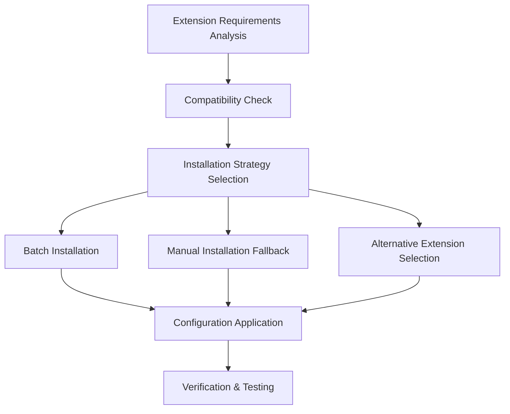

# VS Code Extension Setup Design Document

## Overview

This design document outlines the solution for setting up VS Code extensions for the Kairos project development environment. The solution addresses compatibility issues with Kiro IDE and provides alternative approaches for essential development tools including Python, React, Docker, and DevOps support.

## Architecture

The extension setup system follows a layered approach:



## Components and Interfaces

### 1. Extension Categorization System

**Core Categories:**
- **Language Support**: Python, JavaScript/TypeScript, HTML/CSS
- **Framework Support**: React, FastAPI
- **DevOps Tools**: Docker, Kubernetes, YAML
- **Development Tools**: Git, Debugging, Formatting
- **API Development**: REST clients, API testing

### 2. Compatibility Resolution Engine

**Primary Strategy**: Use VS Code native extensions when possible
**Fallback Strategy**: Alternative extensions or manual configuration
**Conflict Resolution**: Priority-based extension selection

### 3. Installation Methods

#### Method 1: Command Line Installation
```bash
# Core Python extensions
code --install-extension ms-python.python
code --install-extension ms-python.pylance

# React/JavaScript extensions  
code --install-extension dsznajder.es7-react-js-snippets
code --install-extension formulahendry.auto-rename-tag

# Development tools
code --install-extension eamodio.gitlens
code --install-extension esbenp.prettier-vscode
```

#### Method 2: Extensions Panel Installation
- Manual installation through VS Code Extensions marketplace
- Search and install individual extensions
- Enable/disable as needed

#### Method 3: Workspace Configuration
```json
{
  "recommendations": [
    "ms-python.python",
    "ms-python.pylance",
    "dsznajder.es7-react-js-snippets",
    "eamodio.gitlens"
  ]
}
```

## Data Models

### Extension Configuration Schema
```typescript
interface ExtensionConfig {
  id: string;
  name: string;
  category: 'language' | 'framework' | 'devops' | 'tools';
  priority: 'essential' | 'recommended' | 'optional';
  alternatives?: string[];
  settings?: Record<string, any>;
  compatibility: {
    vscode_min_version: string;
    conflicts?: string[];
  };
}
```

### Installation Result Schema
```typescript
interface InstallationResult {
  extension_id: string;
  status: 'installed' | 'failed' | 'alternative_used';
  method: 'cli' | 'manual' | 'workspace';
  error_message?: string;
  alternative_used?: string;
}
```

## Error Handling

### Compatibility Issues
- **Docker Extension Incompatibility**: Use alternative container management tools or manual Docker CLI
- **Version Conflicts**: Prioritize essential extensions, disable conflicting ones
- **Installation Failures**: Provide manual installation instructions

### Fallback Strategies
1. **Alternative Extensions**: When primary extension fails, suggest alternatives
2. **Manual Configuration**: Provide manual setup instructions for critical tools
3. **Workspace Settings**: Configure project-specific settings without extensions

## Testing Strategy

### Verification Steps
1. **Extension Installation Verification**: Check if extensions are properly installed and enabled
2. **Functionality Testing**: Verify syntax highlighting, IntelliSense, and debugging work
3. **Integration Testing**: Ensure extensions work together without conflicts
4. **Performance Testing**: Monitor VS Code startup time and responsiveness

### Test Cases
- Install all essential extensions via CLI
- Test React component development with JSX support
- Verify Python debugging and IntelliSense
- Test Git integration and version control features
- Validate Docker file syntax highlighting (or alternative)

## Implementation Approach

### Phase 1: Essential Extensions
Focus on core language support (Python, JavaScript) and basic development tools

### Phase 2: Framework Support
Add React, FastAPI, and web development specific extensions

### Phase 3: DevOps Integration
Implement Docker alternatives and deployment tools

### Phase 4: Advanced Features
Add specialized tools for monitoring, testing, and optimization

## Alternative Solutions for Docker Compatibility

Since Docker extension shows compatibility issues:

### Option 1: Docker CLI Integration
- Use integrated terminal for Docker commands
- Create custom tasks in VS Code for common Docker operations
- Use Docker Compose files with YAML extension support

### Option 2: Alternative Container Extensions
- **Remote - Containers**: For development inside containers
- **Kubernetes**: For container orchestration
- **YAML**: For Docker Compose file support

### Option 3: External Tools Integration
- Docker Desktop for GUI management
- Portainer for web-based container management
- Custom scripts for Docker operations

## Configuration Management

### Workspace Settings (.vscode/settings.json)
```json
{
  "python.defaultInterpreterPath": "./venv/bin/python",
  "python.linting.enabled": true,
  "python.linting.pylintEnabled": true,
  "editor.formatOnSave": true,
  "editor.codeActionsOnSave": {
    "source.organizeImports": true
  }
}
```

### Extension Recommendations (.vscode/extensions.json)
```json
{
  "recommendations": [
    "ms-python.python",
    "ms-python.pylance",
    "dsznajder.es7-react-js-snippets",
    "eamodio.gitlens",
    "esbenp.prettier-vscode",
    "ms-vscode.vscode-eslint"
  ]
}
```

This design provides a robust foundation for setting up the development environment while handling compatibility issues gracefully.