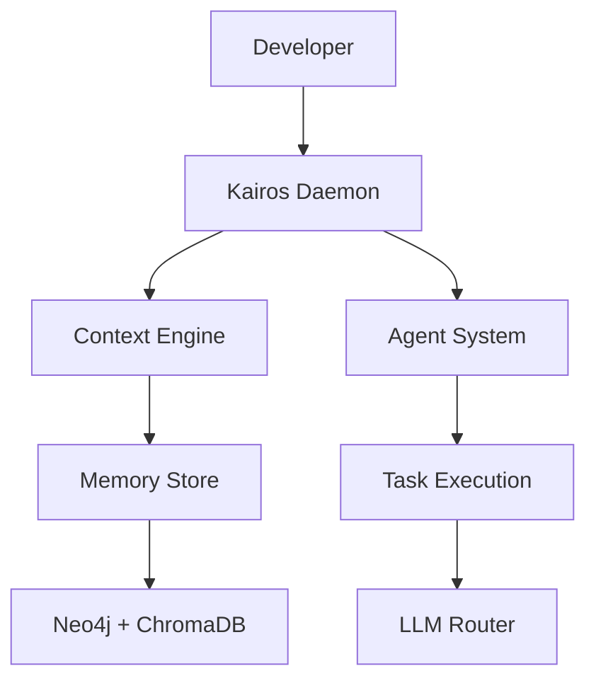

# Kairos: The Context Keeper


## 📖 Manifesto: Curing AI's Contextual Amnesia

Modern AI coding assistants are powerful, yet flawed. They suffer from Contextual Amnesia, forgetting the core mission, architectural rules, and historical decisions of a project. This leads to inconsistent, out-of-sync, and often incorrect code.

Kairos was born to solve this fundamental problem. Our philosophy is simple: We trust the LLM's intelligence, but we manage its memory and loyalty. Kairos acts as the project's digital twin—a living, evolving supervisor that ensures the AI never forgets.

## 🧠 Key Features

* **Context Engineering**: Advanced context preservation system that learns and adapts to your development patterns
* **Agent-Based Architecture**: Intelligent agents that handle different aspects of development autonomously
* **DevOps Integration**: Seamless integration with modern DevOps tools and cloud platforms
* **Memory Management**: Sophisticated knowledge graph that maintains project context across time
* **Adaptive Learning**: Self-improving system that gets better with each interaction

## 🤔 Why Kairos?

While tools like Cursor and Copilot are excellent assistants, Kairos operates at a higher level—as a supervisor.

* **Proactive vs. Reactive**: Kairos doesn't just respond to prompts; it proactively manages the project's context, correcting deviations before they become problems.
* **Long-Term Memory**: It builds a comprehensive Knowledge Graph of your project, ensuring that decisions made weeks ago still inform today's code.
* **Autonomous Learning**: Kairos is a self-improving system. It learns from its mistakes and fine-tunes its own local models to become a better partner over time.
* **Model Agnostic**: Work with the best tool for the job. Kairos intelligently routes tasks to local models (Ollama), free cloud tiers (Gemini), or powerful proprietary models, optimizing for cost and performance.

## 🏗️ Architecture



## 🛠️ Tech Stack

* **Backend**: Python, FastAPI
* **Storage**: Neo4j (Knowledge Graph), ChromaDB (Vector Store)
* **AI/ML**: Ollama, OpenRouter, Custom Model Routing
* **DevOps**: Docker, Kubernetes, Prometheus
* **Monitoring**: Grafana, Custom Metrics

## 🚀 Getting Started

```bash
# Clone the repository
git clone https://github.com/turtir-ai/kairos-context-keeper.git
cd kairos-context-keeper

# Install dependencies (if not using Docker)
pip install -r requirements.txt

# Run all services with Docker (Recommended)
# This will start the Kairos Daemon, Neo4j, ChromaDB, and monitoring stack
docker-compose up -d

# Start and interact with the Kairos supervisor
kairos start
```

> For detailed setup instructions and configuration options, please see the [docs/](docs/) directory.

## 📈 Roadmap

* Core context engine implementation
* Advanced agent system with specialized roles
* Memory store optimization and scaling
* Task planning and execution improvements
* Multi-repository support
* Team collaboration features
* Custom model fine-tuning pipeline

## 🤝 Contributing

We welcome contributions! Please read our [Contributing Guide](docs/CONTRIBUTING.md) to get started.

## 🏆 Recognition

Check out our project on [DevPost](https://devpost.com/software/kairos-the-context-keeper)!

## 📜 License

This project is licensed under the MIT License - see the [LICENSE](LICENSE) file for details.

## 🔗 Links

* [Project Website](https://turtir-ai.github.io/kairos-context-keeper)
* [GitHub Repository](https://github.com/turtir-ai/kairos-context-keeper)
* [DevPost Project](https://devpost.com/software/kairos-the-context-keeper)
* [Documentation](docs/)

## 📧 Contact

For questions and support, please email us at turtirhey@gmail.com

## About

Kairos: The Context Keeper is an autonomous development supervisor based on context engineering. It provides a premium project structure for hackathons and developer onboarding, helping teams maintain context and deliver better software faster. By leveraging advanced AI and memory management techniques, it ensures consistent development practices and preserves critical project knowledge across time. 