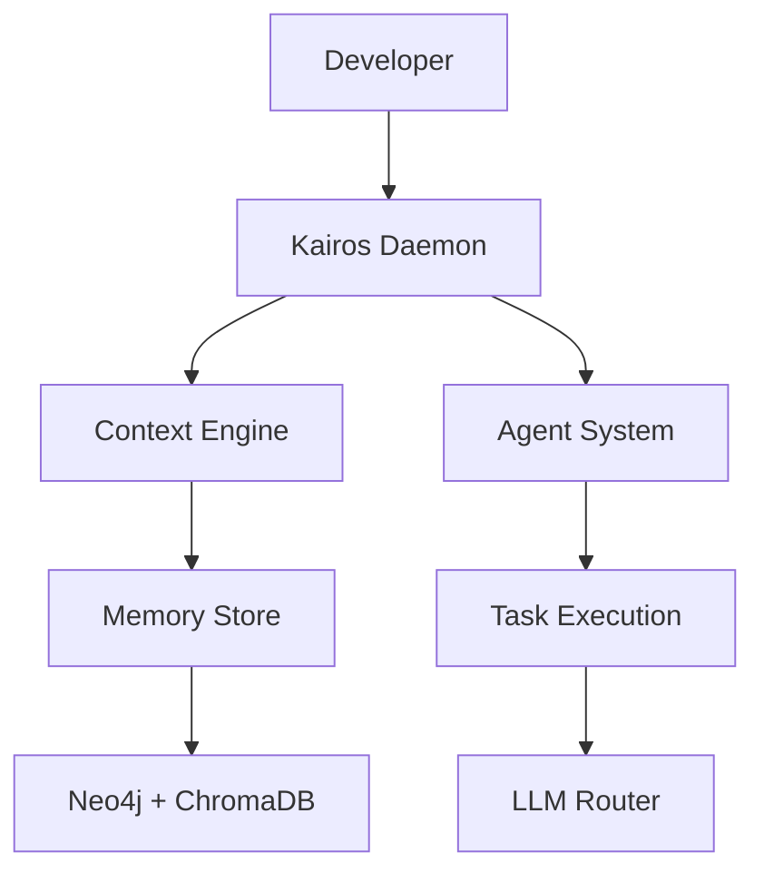

# Kairos: The Context Keeper

<!-- TODO: Add a real banner image -->


## 📖 Manifesto: To Be the Unforgettable Memory of Development

An autonomous development supervisor leveraging context engineering to manage projects from start to finish. Kairos helps teams maintain context, automate routine tasks, and deliver better software faster.

## 🧠 Key Features

- **Context Engineering**: Advanced context preservation system that learns and adapts to your development patterns
- **Agent-Based Architecture**: Intelligent agents that handle different aspects of development
- **DevOps Integration**: Seamless integration with modern DevOps tools and cloud platforms

## 🏗️ Architectural Diagram



## 🛠️ Tech Stack

- **Backend**: Python, FastAPI
- **Storage**: Neo4j, ChromaDB
- **AI/ML**: Ollama, OpenRouter
- **DevOps**: Docker, Kubernetes
- **Monitoring**: Prometheus, Grafana

## 🚀 Getting Started

```bash
# Clone the repository
git clone https://github.com/turtir-ai/kairos-context-keeper.git

# Navigate to the project directory
cd kairos-context-keeper

# Install dependencies
pip install -r requirements.txt

# Start the daemon
python src/daemon.py
```

> For a detailed setup and configuration guide, please see the docs/ directory.

## 📈 Roadmap

- [x] Core context engine implementation
- [x] Basic agent system
- [x] Memory store integration
- [ ] Advanced task planning
- [ ] Multi-repository support
- [ ] Team collaboration features

## 🤝 Contributing

We welcome contributions! Please read our [Contributing Guide](docs/COMMUNITY.md) to get started.

## 🏆 Recognition

Check out our project on [DevPost](https://devpost.com/software/kairos-the-context-keeper)!

## 📜 License

This project is licensed under the MIT License - see the [LICENSE](LICENSE) file for details.

## 🔗 Links

- [Project Website](https://turtir-ai.github.io/kairos-context-keeper)
- [GitHub Repository](https://github.com/turtir-ai/kairos-context-keeper)
- [DevPost Project](https://devpost.com/software/kairos-the-context-keeper)
<!-- TODO: Update with the actual Discord invite link -->

## 📧 Contact

For questions and support, please email us at turtirhey@gmail.com 

## About | Hakkında

🇬🇧 **English**  
Kairos: The Context Keeper is an autonomous development supervisor based on context engineering. It provides a premium project structure for hackathons and developer onboarding, helping teams maintain context and deliver better software faster.

🇹🇷 **Türkçe**  
Kairos: The Context Keeper, bağlam mühendisliğine dayalı otonom bir geliştirme süpervizörüdür. Hackathon ve geliştirici uyum süreçleri için premium proje yapısı sunar, ekiplerin bağlamı korumalarına ve daha iyi yazılımı daha hızlı teslim etmelerine yardımcı olur. 